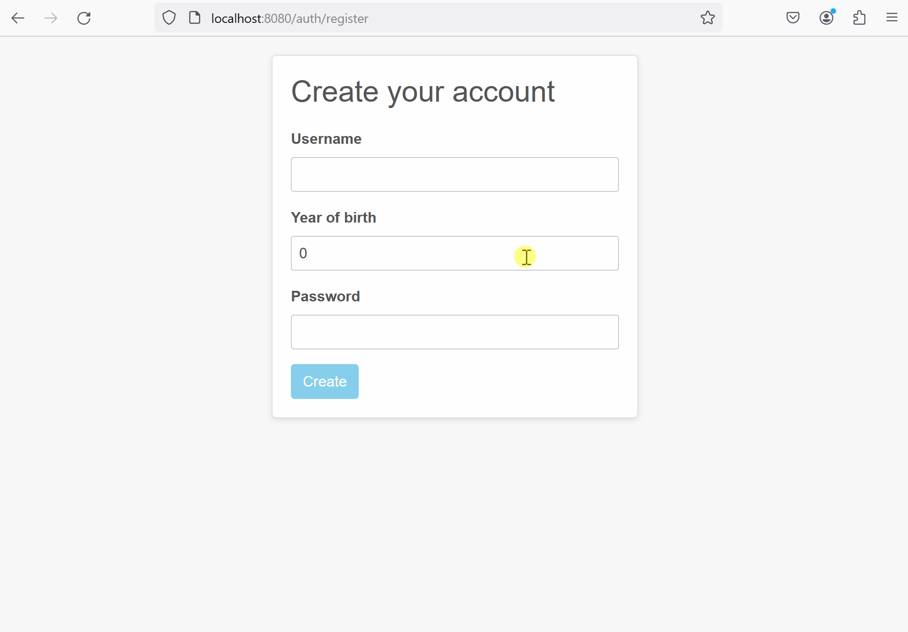
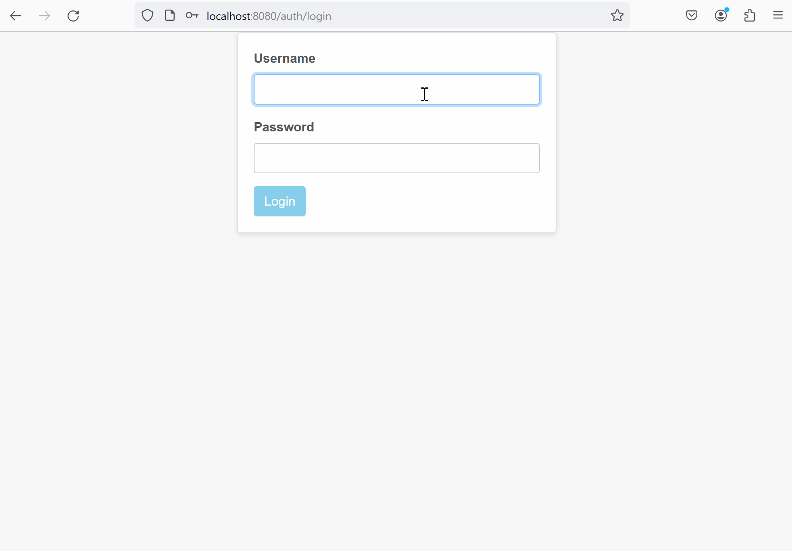

# Authentication and authorization with Spring Security

I write this application to play with Spring Security. You can register, log in and log out. 
Encrypted with BCrypt passwords stored in PostgreSQL database.
There are two roles: `USER` and `ADMIN`. The app also secured with CSRF token.

## What can you do?

Register with validation. 

### Constraints:
- Username must be unique
- Username must be between 5 and 100 characters
- Password must be between 8 and 100 characters
- Year of birth must be greater than 1900

Log in with one of the two roles: `USER` or `ADMIN`. Only `ADMIN` has access to the `\admin` page. 
And you can log out as well.

## Stack
Java, Spring Boot, Spring Security, Spring Data JPA, PostgreSQL, Thymeleaf, Bootstrap.

It ain't much, but it's honest work :sunflower: